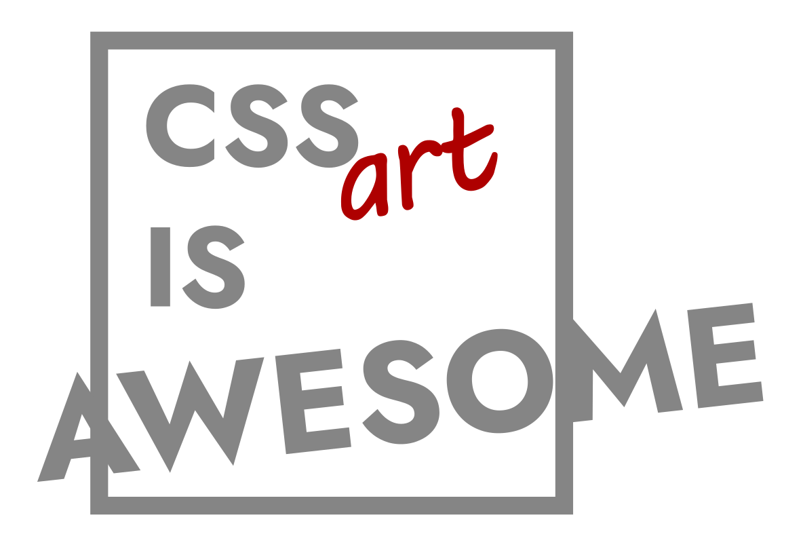
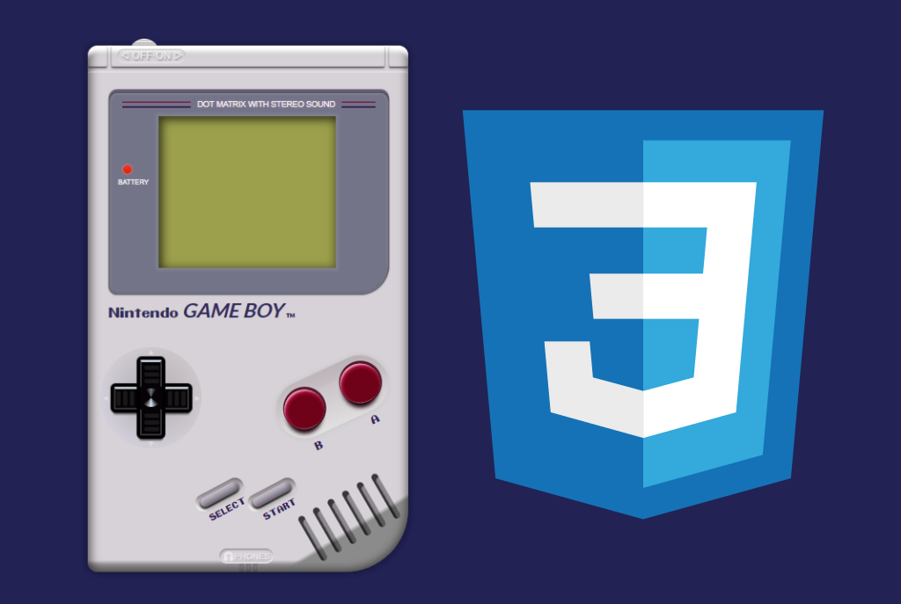
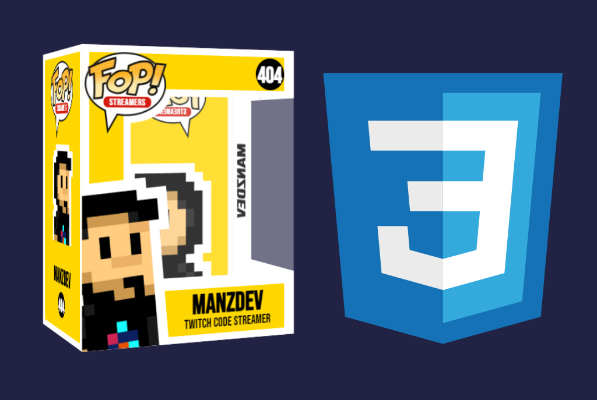
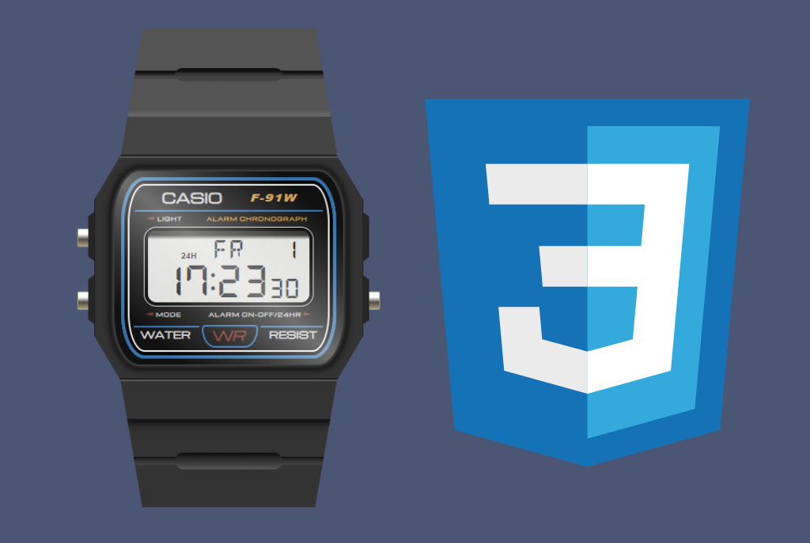
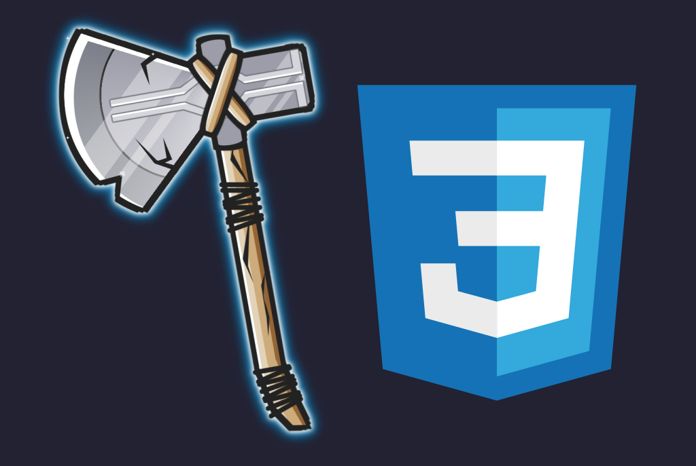
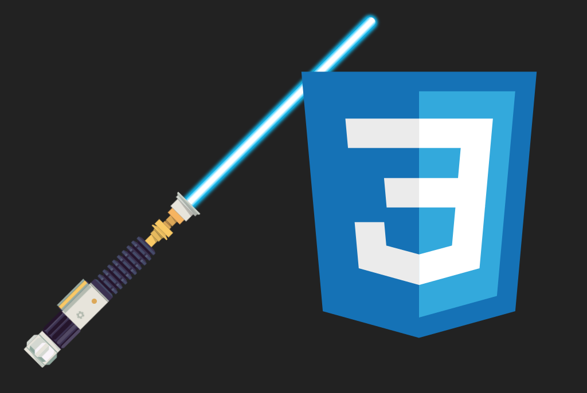

  
  <h1>Awesome CSS Art</h1>
  <i>Design with CSS code, without images!</i>

  <a href="https://twitch.tv/ManzDev">ManzDev en Twitch</a> · <a href="https://links.manz.dev">Otras redes</a> · <a href="https://manz.dev">Manz.dev</a>

---

### 🕹️ Consoles
- 🎮 Nintendo Gameboy CSS · [GitHub](https://github.com/ManzDev/twitch-gameboy-css) · [Demo](https://manzdev.github.io/twitch-gameboy-css)
- 🎮 Nintendo Gameboy Cartridge · [GitHub](https://github.com/ManzDev/twitch-gameboy-cartridge) · [Demo](https://manzdev.github.io/twitch-gameboy-cartridge)
- 🕹️ Nintendo Game & Watch · [GitHub](https://github.com/ManzDev/twitch-nintendo-game-watch-css) · [Demo](https://manzdev.github.io/twitch-nintendo-game-watch-css)
- 🎮 Nintendo Switch · [GitHub](https://github.com/ManzDev/twitch-nintendo-switch) · [Demo](https://manzdev.github.io/twitch-nintendo-switch)
- 🎮 Nintendo NES · [GitHub](https://github.com/ManzDev/twitch-nintendo-nes) · [Demo](https://manzdev.github.io/twitch-nintendo-nes)
- 🎮 Megadrive/Sega Genesis · [GitHub](https://github.com/ManzDev/twitch-megadrive-genesis) · [Demo](https://manzdev.github.io/twitch-megadrive-genesis)
- 🎮 PlayStation 1 (PSX) · [GitHub](https://github.com/ManzDev/twitch-psx) · [Demo](https://manzdev.github.io/twitch-psx)
- 🎮 PlayStation Portable (PSP) · [GitHub](https://github.com/ManzDev/twitch-psp) · [Demo](https://manzdev.github.io/twitch-psp)
- 🥚 Javagotchi · [GitHub](https://github.com/ManzDev/javagotchi) · [Demo](https://manzdev.github.io/javagotchi)

### 👾 Entertainment

- 🤖 Punko Fop (Funko Pop Box) · [GitHub](https://github.com/ManzDev/twitch-punko-fop) · [Demo](https://manzdev.github.io/twitch-punko-fop)
- 🕹️ Claw Machine · [GitHub](https://github.com/ManzDev/twitch-claw-machine) · [Demo](https://manzdev.github.io/twitch-claw-machine)
- 🌌 Solar System · [GitHub](https://github.com/ManzDev/twitch-solar-system) · [Demo](https://manzdev.github.io/twitch-solar-system)

### 💾 Retro

- 🎹 Casio Watch F-91W · [GitHub](https://github.com/ManzDev/twitch-casio) · [Demo](https://manzdev.github.io/twitch-casio)
- 📱 Alcatel One Touch Easy · [GitHub](https://github.com/ManzDev/twitch-alcatel-one-touch-easy) · [Demo](https://manzdev.github.io/twitch-alcatel-one-touch-easy)
- 💾 Diskette 3 1/2 · [GitHub](https://github.com/ManzDev/twitch-diskette) · [Demo](https://manzdev.github.io/twitch-diskette)
- 🔌 ESP32 Dev Board · [GitHub](https://github.com/ManzDev/twitch-esp32-css) · [Demo](https://manzdev.github.io/twitch-esp32-css)
- 💿 Tech Retro Covers · [GitHub](https://github.com/ManzDev/twitch-cover-dev)
- ⌨️ Typewriter CSS · [GitHub](https://github.com/ManzDev/twitch-typewriter-css) · [Demo](https://manzdev.github.io/twitch-typewriter-css)
- 💾 Music Cassette · [GitHub](https://github.com/ManzDev/twitch-cassette) · [Demo](https://manzdev.github.io/twitch-cassette)
- 📎 Microsoft Clippy · [GitHub](https://github.com/ManzDev/twitch-clippy) · [Demo](https://manzdev.github.io/twitch-clippy)
- 🎹 Casio PT1 Piano · [GitHub](https://github.com/ManzDev/twitch-casio-pt1) · [Demo](https://manzdev.github.io/twitch-casio-pt1)
- 🎹 Casio Calculator FX39 · [GitHub](https://github.com/ManzDev/twitch-casio-fx39) · [Demo](https://manzdev.github.io/twitch-casio-fx39)
- 📱 Nokia 3310 · [GitHub](https://github.com/ManzDev/twitch-nokia3310) · [Demo](https://manzdev.github.io/twitch-nokia3310)

### 📺 Devices

- 📺 CRT Monitor · [GitHub](https://github.com/ManzDev/twitch-crt-monitor) · [Demo](https://manzdev.github.io/twitch-crt-monitor)
- 📺 Retro TV · [GitHub](https://github.com/ManzDev/twitch-tv) · [Demo](https://manzdev.github.io/twitch-tv)
- 🎮 ZX Spectrum · [GitHub](https://github.com/ManzDev/twitch-zx-spectrum) · [Demo](https://manzdev.github.io/twitch-zx-spectrum)
- ⌨️ Keyboard CSS · [GitHub](https://github.com/ManzDev/twitch-keyboard) · [Demo](https://manzdev.github.io/twitch-keyboard)

### 🧙‍♂️ SciFi/Fantasy

- 🚗 Delorean CSS · [GitHub](https://github.com/ManzDev/twitch-delorean-css) · [Demo](https://manzdev.github.io/twitch-delorean-css)
- 🛸 Tars · [GitHub](https://github.com/ManzDev/twitch-tars) · [Demo](https://manzdev.github.io/twitch-tars)
- 🛸 OVNI · [GitHub](https://github.com/ManzDev/twitch-ovni) · [Demo](https://manzdev.github.io/twitch-ovni)
- 🔨 Stormbreaker · [GitHub](https://github.com/ManzDev/twitch-stormbreaker) · [Demo](https://manzdev.github.io/twitch-stormbreaker)
- 🎥 Manz9000 OBS · [GitHub](https://github.com/ManzDev/twitch-manz9000-obs) · [Demo](https://manzdev.github.io/twitch-manz9000-obs)

### 🌌 StarWars

- 🤖 AT-AT · [GitHub](https://github.com/ManzDev/twitch-at-at) · [Demo](https://manzdev.github.io/twitch-at-at)
- 🔦 Lightsaber · [GitHub](https://github.com/ManzDev/twitch-lightsaber) · [Demo](https://manzdev.github.io/twitch-lightsaber)
- 🚀 Millennium Falcon · [GitHub](https://github.com/ManzDev/twitch-millennium-falcon) · [Demo](https://manzdev.github.io/twitch-millennium-falcon)
- 🤖 R2D2 · [GitHub](https://github.com/ManzDev/twitch-r2d2) · [Demo](https://manzdev.github.io/twitch-r2d2)

### 🤖 Robots

- 🤖 GLaDOS Potato · [GitHub](https://github.com/ManzDev/twitch-glados-potato) · [Demo](https://manzdev.github.io/twitch-glados-potato)
- 🔲 Companion Cube · [GitHub](https://github.com/ManzDev/twitch-companion-cube) · [Demo](https://manzdev.github.io/twitch-companion-cube)
- 🎮 Turret Portal · [GitHub](https://github.com/ManzDev/twitch-turret) · [Demo](https://manzdev.github.io/twitch-turret/)
- 🤖 Bender · [GitHub](https://github.com/ManzDev/twitch-bender) · [Demo](https://manzdev.github.io/twitch-bender)
- 🤖 Wall-E Eve · [GitHub](https://github.com/ManzDev/twitch-wall-e-eve) · [Demo](https://manzdev.github.io/twitch-wall-e-eve)
- 🤖 Robotnik · [GitHub](https://github.com/ManzDev/twitch-robotnik) · [Demo](https://manzdev.github.io/twitch-robotnik)

### 🙍‍♂️ Characters

- 💥 Powerpuff Girls · [GitHub](https://github.com/ManzDev/twitch-powerpuffgirls) · [Demo](https://manzdev.github.io/twitch-powerpuffgirls)
- 😶 Noface · [GitHub](https://github.com/ManzDev/twitch-noface) · [Demo](https://manzdev.github.io/twitch-noface)
- 🍳 Fry · [GitHub](https://github.com/ManzDev/twitch-fry) · [Demo](https://manzdev.github.io/twitch-fry)
- 💥 Goku · [GitHub](https://github.com/ManzDev/twitch-goku) · [Demo](https://manzdev.github.io/twitch-goku)
- 🔮 Bill Cypher · [GitHub](https://github.com/ManzDev/twitch-bill-cypher) · [Demo](https://manzdev.github.io/twitch-bill-cypher)
- 🤣 Peter Griffin · [GitHub](https://github.com/ManzDev/twitch-peter-griffin) · [Demo](https://manzdev.github.io/twitch-peter-griffin)
- 🛸 Ricky Morty · [GitHub](https://github.com/ManzDev/twitch-rickymorty) · [Demo](https://manzdev.github.io/twitch-rickymorty)
- 🎮 Squid Game · [GitHub](https://github.com/ManzDev/twitch-squid-game) · [Demo](https://manzdev.github.io/twitch-squid-game)
- 🕶 Gordon Freeman · [GitHub](https://github.com/ManzDev/twitch-gordon-freeman) · [Demo](https://manzdev.github.io/twitch-gordon-freeman)
- 🚀 Buzz Lightyear · [GitHub](https://github.com/ManzDev/twitch-buzz-lightyear) · [Demo](https://manzdev.github.io/twitch-buzz-lightyear)
- 😀 Face Generator · [GitHub](https://github.com/ManzDev/twitch-face-generator) · [Demo](https://manzdev.github.io/twitch-face-generator)
- 🍩 Homer CSS · [GitHub](https://github.com/ManzDev/homer-meme-css) · [Demo](https://manzdev.github.io/homer-meme-css)

### ⚡ Pokémon

- 👻 Gengar · [GitHub](https://github.com/ManzDev/twitch-gengar) · [Demo](https://manzdev.github.io/twitch-gengar)
- 👻 Haunter · [GitHub](https://github.com/ManzDev/twitch-haunter) · [Demo](https://manzdev.github.io/twitch-haunter)
- 👻 Gastly · [GitHub](https://github.com/ManzDev/twitch-gastly) · [Demo](https://manzdev.github.io/twitch-gastly)
- ⚡ Pikachu · [GitHub](https://github.com/ManzDev/twitch-pikachu) · [Demo](https://manzdev.github.io/twitch-pikachu)

### 🎇 Seasons/places

- 🌦️ Weather City · [GitHub](https://github.com/ManzDev/twitch-weather-city/) · [Demo](https://manzdev.github.io/twitch-weather-city)
- 🎬 Cinema · [GitHub](https://github.com/ManzDev/twitch-cinema) · [Demo](https://manzdev.github.io/twitch-cinema)
- ⛄ Snowman Ball · [GitHub](https://github.com/ManzDev/twitch-snowman-ball) · [Demo](https://manzdev.github.io/twitch-snowman-ball)
- 🎃 Halloween 2023 · [GitHub](https://github.com/ManzDev/twitch-halloween-2023) · [Demo](https://manzdev.github.io/twitch-halloween-2023)
- 🎅 Xmas 2021 · [GitHub](https://github.com/ManzDev/twitch-xmas-2021) · [Demo](https://manzdev.github.io/twitch-xmas-2021)

### 🖥 UI

- 💾 Microsoft Scandisk · [GitHub](https://github.com/ManzDev/twitch-scandisk) · [Demo](https://manzdev.github.io/twitch-scandisk)
- ⚽ PC Futbol UI · [GitHub](https://github.com/ManzDev/twitch-pcfutbol) · [Demo](https://manzdev.github.io/twitch-pcfutbol)
- 🌙 After Dark Screensaver · [GitHub](https://github.com/ManzDev/twitch-after-dark) · [Demo](https://manzdev.github.io/twitch-after-dark)
- ⚽ CSS Futbol · [GitHub](https://github.com/ManzDev/css-futbol) · [Demo](https://manzdev.github.io/css-futbol)
- 💻 Windows 95 CSS · [GitHub](https://github.com/ManzDev/twitch-win95) · [Demo](https://manzdev.github.io/twitch-win95)

---

Hi! I'm Manz, 👨🏽‍💻 FullStack developer and 🥑 FrontEnd / WebPlatform standards advocate

- 🧰 FullStack/Frontend Engineer / ❤️ [CSS](https://lenguajecss.com/) lover
- 🎓 Teacher & Director at EOI / ex-teacher at ULL
- 🎬 Partner content creator on Twitch & Youtube
- 👾 Gamer & Geek (Graphic Adventures / Pixel Art)

> More demos and code: [https://manz.dev/streams/](https://manz.dev/streams/)
